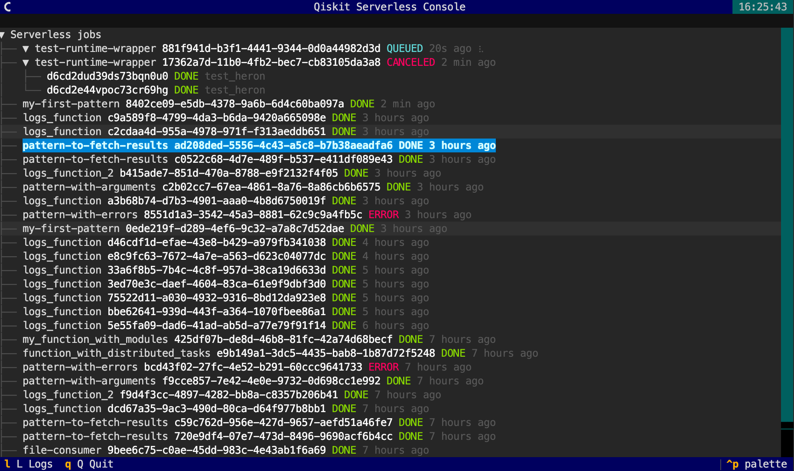

# qiskit-serverless-console

Standalone console project to watch Qiskit Serverless jobs and related Qiskit Runtime jobs.

Features:
- Show status in realtime (polling data every 1sec)
- Show runtime jobs as children
- Press L to see the logs
- Press S to stop a job (with confirmation modal)



## Install

```bash
pip install -r requirements.txt
pip install -e .
```

This installs:

`qiskit-serverless-jobs-watch`

## Environment Variables

The CLI reads auth and endpoints from environment variables (no auth/url flags).

Serverless + Runtime shared auth:
- `QISKIT_IBM_TOKEN` Required. Token.
- `QISKIT_IBM_INSTANCE` Required. IBM Cloud CRN instance.

Serverless connection:
- `ENV_GATEWAY_PROVIDER_HOST` Optional. Default: `https://qiskit-serverless.quantum.ibm.com`
- `ENV_GATEWAY_PROVIDER_TOKEN` Optional. Token for Serverless API. Falls back to `QISKIT_IBM_TOKEN` if not set.

Runtime connection:
- `QISKIT_IBM_URL` Optional, Default: `https://cloud.ibm.com`)
- `QISKIT_IBM_CHANNEL` Optional. Default: `ibm_quantum_platform`)

## Staging

For staging, set:
- `QISKIT_IBM_URL=https://test.cloud.ibm.com`
- `ENV_GATEWAY_PROVIDER_HOST=https://qiskit-serverless-dev.quantum.ibm.com`

## Usage

```bash
qiskit-serverless-jobs-watch
```

Available CLI options (only non-env configuration):
- `--job-id`
- `--function`
- `--status` (repeatable)
- `--last-hours` (default: `2.0`)
- `--limit` (default: `50`)
- `--offset` (default: `0`)
- `--interval` (default: `1`)
- `--json`
- `--no-color`

Examples:

```bash
qiskit-serverless-jobs-watch --status RUNNING --status QUEUED
qiskit-serverless-jobs-watch --last-hours 6 --interval 2
qiskit-serverless-jobs-watch --json
```

## Behavior

- Refreshes continuously until `Ctrl+C`.
- Shows newest jobs at the top (sorted by `created` descending).
- Displays runtime jobs as child lines under each serverless job.
- Uses a background thread to refresh runtime status cache.
- Stops polling terminal runtime jobs.
- If status/backend (or other key display fields) is missing, shows an animated spinner placeholder.
